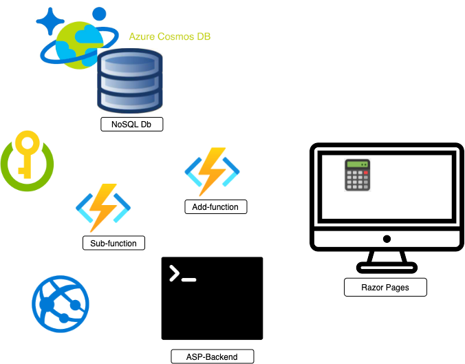

# Mini Calculator - Cloud Exam
## Required Parts
1 Cosmos DB
1 Azure function for addition
1 Azure function for subtraction
1 One Razor Page frontend

- all calculations should be saved in the database
- The frontend should take the input and then display both the answer and the 10 latest calculations.
- Automatic deploy to Azure
- Logging in Insights
- GitHub Action bygg pipeline
- Docker images
  
## Mockup



```shell
git remote add upstream https://github.com/RobinAxelsson/MolnTentaDeploy.git
```