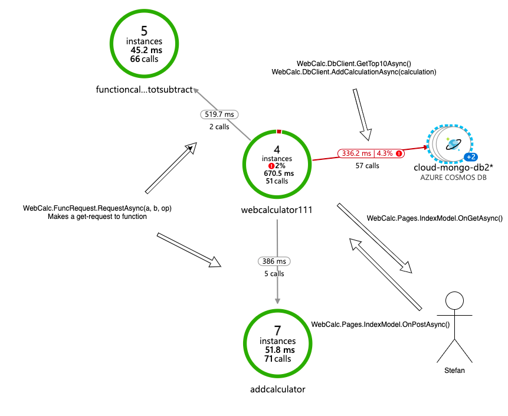

# Mini Calculator - Cloud Exam
## Two Remotes
In this project I have pushed to two remotes as a quick fix to be able to deploy to Azure with GitHub Actions.
[Action Repo Link](https://github.com/RobinAxelsson/MolnTentaDeploy)

## Two Azure Functions - Same Source
It is a requirement in the description to have one add azure function App and one sub azure function App and to do this efficiently I use the same source code but use a configuration variable to switch between the two operations. Therefor the same code can be deployed to two different Azure Functions App. [Source Link HttpTrigger.cs](https://github.com/PGBSNH20/moln-tenta-RobinAxelsson/blob/main/src/Calculator/HttpTrigger.cs)

```csharp
string Operation = Environment.GetEnvironmentVariable("Operation");
bool isAdd = Operation == "ADDITION" ? true :
Operation == "SUBTRACTION" ? false : throw new ArgumentException("Input variables are incorrect", Operation);
```
## App Insights Overview


## Front End


## Back End

```shell
2021-10-15T09:54:57.939511144Z: [INFO]  info: WebCalc.Pages.IndexModel[0]
2021-10-15T09:54:57.939550344Z: [INFO]        POSTED:a=4 b=4 op=ADDITION
2021-10-15T10:05:53.231914200Z: [INFO]  info: WebCalc.Pages.IndexModel[0]
2021-10-15T10:05:53.231958900Z: [INFO]        POSTED:a=6 b=6 op=ADDITION
2021-10-15T10:07:24.317935428Z: [INFO]  info: WebCalc.Pages.IndexModel[0]
2021-10-15T10:07:24.317980228Z: [INFO]        POSTED:a=6 b=-6 op=SUBTRACTION
2021-10-15T10:08:17.805782525Z: [INFO]  info: WebCalc.Pages.IndexModel[0]
2021-10-15T10:08:17.805826425Z: [INFO]        POSTED:a=5 b=-5 op=SUBTRACTION
2021-10-15T10:08:34.348771655Z: [INFO]  info: WebCalc.Pages.IndexModel[0]
2021-10-15T10:08:34.348835555Z: [INFO]        POSTED:a=-6 b=10 op=SUBTRACTION
/appsvctmp/volatile/logs/runtime/afb0b7e9b9f61904a1c4953ca11410ba6b3e979a0d7b0bc6d41a5441b566e8d8.log
2021-10-15T09:39:57.725135802Z: [INFO]  Hosting environment: Production
2021-10-15T09:39:57.726700722Z: [INFO]  Content root path: /app
2021-10-15T09:39:57.727262728Z: [INFO]  Now listening on: http://[::]:8081
2021-10-15T09:39:57.735805834Z: [INFO]  Application started. Press Ctrl+C to shut down.
/appsvctmp/volatile/logs/runtime/cd8c430ff040b5b2d03f719bdf5d81a5baf46b2b37be4f99f1f6c776c25a7b44.log
2021-10-15T09:08:42.106551770Z: [INFO]  warn: Microsoft.AspNetCore.HttpsPolicy.HttpsRedirectionMiddleware[3]
2021-10-15T09:08:42.106590870Z: [INFO]        Failed to determine the https port for redirect.
2021-10-15T09:10:33.442602433Z: [INFO]  info: WebCalc.Pages.IndexModel[0]
2021-10-15T09:10:33.442658334Z: [INFO]        Page was requested.
2021-10-15T09:10:50.830257729Z: [INFO]  info: WebCalc.Pages.IndexModel[0]
2021-10-15T09:10:50.830297330Z: [INFO]        POSTED:a=2 b=-99999 op=ADDITION
2021-10-15T09:11:00.554595420Z: [INFO]  info: WebCalc.Pages.IndexModel[0]
2021-10-15T09:11:00.554634021Z: [INFO]        POSTED:a=5 b=9999 op=SUBTRACTION
2021-10-15T09:25:05.615820231Z: [INFO]  info: WebCalc.Pages.IndexModel[0]
2021-10-15T09:25:05.615864431Z: [INFO]        POSTED:a=88 b=88 op=ADDITION
```

## Github PipeLine


### Production test web app


### Production test functions


## Production test overview
